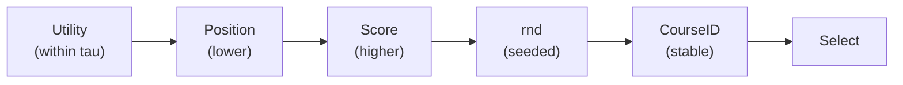

# HBS Social: Course Allocation with Friendships

A deterministic snake-draft course allocation engine with **reactive social preferences**. Built as a master's thesis project, the system extends the classic HBS (Harvard Business School) draft mechanism by incorporating directed friendship preferences into the utility model, with three post-draft improvement strategies.

**Key properties:** zero external dependencies, fully deterministic (seeded RNG), reproducible results, extensive fairness metrics.

---

## Table of Contents

- [Features](#features)
- [Requirements](#requirements)
- [Project Structure](#project-structure)
- [Quick Start](#quick-start)
- [Input Data Format](#input-data-format)
- [CLI Reference](#cli-reference)
  - [Data Generator](#data-generator-generategenerate_tablespy)
  - [Allocator](#allocator-hbs_socialpy)
- [Mathematical Model](#mathematical-model)
  - [Base Utility](#base-utility-table-1)
  - [Friend Preference](#friend-preference-table-2)
  - [Reactive Friend Bonus](#reactive-friend-bonus)
  - [Total Utility](#total-utility)
  - [Pick Rule and Tie-Breaking](#pick-rule-and-tie-breaking)
  - [Snake Draft Order](#snake-draft-order)
- [Post-Draft Improvement](#post-draft-improvement)
  - [Swap Mode](#swap-mode)
  - [Add-Drop Mode](#add-drop-mode)
  - [Adaptive Mode](#adaptive-mode)
- [Fairness Metrics](#fairness-metrics)
- [Output Files](#output-files)
- [Testing](#testing)
- [Interactive Visualization](#interactive-visualization)
- [End-to-End Example](#end-to-end-example)

---

## Features

- **Snake draft allocation** with configurable number of rounds and per-student course limits.
- **Reactive friend bonus** that rewards overlap with friends who are *already* allocated to the same course, avoiding circular dependencies.
- **Per-student social weight** (lambda) controlling the base vs. friend trade-off.
- **Three post-draft improvement modes:** swap, add-drop, adaptive.
- **Deterministic tie-breaking** chain: utility (within tau) &rarr; position &rarr; score &rarr; seeded random &rarr; course ID.
- **Comprehensive fairness metrics:** Gini, Jain, Theil, Atkinson indices; percentile distributions; friend overlap statistics.
- **Audit trail:** every pick and post-phase move is logged with full utility decomposition.
- **Interactive visualization** (HTML/Canvas) with animated bipartite graph, step-by-step playback, and utility breakdown charts.

---

## Requirements

- **Python 3.10+**
- No external dependencies (standard library only).

---

## Project Structure

```
.
├── hbs_social.py                  # CLI entrypoint
├── hbs_visualization.html         # Interactive browser visualization
├── HBS/
│   ├── __init__.py
│   ├── hbs_api.py                 # Public API (orchestration layer)
│   ├── hbs_cli.py                 # Argument parsing and output coordination
│   ├── hbs_config.py              # Configuration dataclass
│   ├── hbs_domain.py              # Data model (7 frozen dataclasses)
│   ├── hbs_engine.py              # Core allocation engine (~1270 LOC)
│   ├── hbs_io.py                  # CSV readers/writers with schema validation
│   └── hbs_metrics.py             # Gini, Jain, Theil, Atkinson computations
├── generate/
│   └── generate_tables.py         # Synthetic data generator
└── tests/
    ├── run_all_tests.py           # Test runner
    ├── test_base_utility.py       # Base utility mapping tests
    ├── test_friend_bonus.py       # Reactive friend bonus tests
    ├── test_gini_index.py         # Gini coefficient tests
    ├── test_tie_breaks.py         # Tie-breaking logic tests
    ├── test_reproducibility.py    # Determinism / seed tests
    ├── test_input_validation.py   # Input validation tests
    └── test_adaptive_improvement.py  # Adaptive mode tests
```

---

## Quick Start

**1. Generate sample data:**

```bash
python generate/generate_tables.py --students 200 --courses 8 --seed 11
```

**2. Run the allocator:**

```bash
python hbs_social.py \
  --csv-a tables/table1_individual.csv \
  --csv-b tables/table2_pair.csv \
  --cap-default 80 --b 3 --seed 11
```

**3. Run with post-draft improvement:**

```bash
python hbs_social.py \
  --csv-a tables/table1_individual.csv \
  --csv-b tables/table2_pair.csv \
  --csv-lambda tables/table3_lambda.csv \
  --cap-default 80 --b 3 --draft-rounds 3 \
  --post-iters 10 --improve-mode adaptive \
  --seed 11 --progress
```

**4. Run tests:**

```bash
python tests/run_all_tests.py
```

**5. Open the visualization:**

Open `hbs_visualization.html` in a browser. Select a scenario, press **Play** or step through with **Следующий ход**.

> `tables/` is local data and not tracked in version control. Use the generator to create sample CSVs.

---

## Input Data Format

The allocator expects two required CSV files and one optional:

### Table 1 &mdash; Individual Course Preferences (required)

| Column     | Type | Description                                |
|------------|------|--------------------------------------------|
| StudentID  | str  | Unique student identifier                  |
| CourseID   | str  | Unique course identifier                   |
| Score      | int  | Raw score (used for deterministic tie-breaking) |
| Position   | int  | 1-based rank (1 = most preferred). Defines base utility |

### Table 2 &mdash; Directed Friend Preferences (required)

| Column       | Type     | Description                                   |
|--------------|----------|-----------------------------------------------|
| StudentID_A  | str      | Student expressing the preference              |
| StudentID_B  | str      | The friend                                      |
| CourseID     | str      | Course context                                  |
| Position     | int      | 1-based rank among A's friends for this course  |
| Score        | int/null | Intensity of preference. If missing, falls back to position-based mapping |

Semantics: "Student A prefers to be in CourseID together with Student B."

### Table 3 &mdash; Per-Student Social Weight (optional)

| Column       | Type  | Description                            |
|--------------|-------|----------------------------------------|
| StudentID    | str   | Student identifier                     |
| LambdaFriend | float | Social weight in [0, 1]. Default: 0.5 if this file is omitted |

Lambda controls the trade-off: `lambda=0` means pure individual preference, `lambda=1` means pure social preference.

---

## CLI Reference

### Data Generator (`generate/generate_tables.py`)

Creates synthetic CSV files for testing.

```bash
python generate/generate_tables.py \
  --students 120 --courses 6 --seed 7 \
  --score-min 1 --score-max 7 \
  --friend-top-k 4 \
  --lambda-default 0.25 \
  --out1 tables/table1.csv \
  --out2 tables/table2.csv \
  --out3 tables/table3.csv
```

| Flag | Default | Description |
|------|---------|-------------|
| `--students N` | *(prompt)* | Number of students |
| `--courses K` | *(prompt)* | Number of courses |
| `--seed INT` | None | RNG seed |
| `--score-min/max` | 1 / 5 | Score range for Table 1 |
| `--swap-prob` | 0.0 | Probability of swapping adjacent positions (noise) |
| `--friend-top-k` | 3 | Friends per (student, course) in Table 2 |
| `--friend-score-min/max` | same as score | Score range for Table 2 |
| `--friend-score-mode` | score_first | `score_first` or `position_first` |
| `--lambda-default` | 0.3 | Lambda value for all students in Table 3 |
| `--out1/out2/out3` | tables/*.csv | Output file paths |

### Allocator (`hbs_social.py`)

```bash
python hbs_social.py \
  --csv-a TABLE1.csv --csv-b TABLE2.csv \
  --csv-lambda TABLE3.csv \
  --cap-default 80 --b 3 \
  --draft-rounds 3 --post-iters 10 \
  --improve-mode adaptive --seed 42 \
  --progress --sanity-checks
```

**Input flags:**

| Flag | Default | Description |
|------|---------|-------------|
| `--csv-a` | tables/table1_individual.csv | Table 1 CSV |
| `--csv-b` | tables/table2_pair.csv | Table 2 CSV |
| `--csv-lambda` | None | Table 3 CSV (optional) |

**Algorithm flags:**

| Flag | Default | Description |
|------|---------|-------------|
| `--cap-default` | 10 | Seats per course |
| `--b` | 3 | Max courses per student |
| `--draft-rounds` | b | Number of snake-draft rounds |
| `--post-iters` / `--n` | 0 | Post-phase iterations |
| `--improve-mode` | swap | `swap`, `add-drop`, or `adaptive` |
| `--seed` | 42 | RNG seed for reproducibility |

**Output flags:**

| Flag | Default | Description |
|------|---------|-------------|
| `--out-allocation` | allocation.csv | Draft picks log |
| `--out-adddrop` | post_allocation.csv | Post-phase event log |
| `--out-summary` | summary.csv | Summary metrics (one row) |
| `--out-metrics-extended` | metrics_extended.csv | Extended fairness metrics |

**Debug flags:**

| Flag | Description |
|------|-------------|
| `--progress` | Print iteration progress |
| `--sanity-checks` | Enable allocation invariant checks |
| `--delta-check-every N` | Validate move deltas every N moves (0 = off) |
| `--log-level` | `CRITICAL` / `ERROR` / `WARNING` / `INFO` / `DEBUG` |

---

## Mathematical Model

### Base Utility (Table 1)

Affine min-max scaling of a 1-based rank to [0, 1]:

$$
\text{Base}(s, c) = \text{posU}(\text{Position}_A(s,c),\; |C|)
$$

$$
\text{posU}(p, K) =
\begin{cases}
0, & p \text{ is missing} \\
1, & K \le 1 \land p = 1 \\
\frac{K - p}{K - 1}, & K > 1
\end{cases}
$$

*Code:* `HBS/hbs_engine.py:25` (`_pos_u`)

*Example (K=4):* posU(1)=1, posU(2)=2/3, posU(3)=1/3, posU(4)=0.

### Friend Preference (Table 2)

When **Score is present**, the preference weight uses min-max normalization:

$$
\text{Pref}(s, f, c) = \text{scoreU}(\text{Score}_B(s,f,c)) = \left[\frac{\text{score} - \text{score}_{\min}}{\text{score}_{\max} - \text{score}_{\min}}\right]_0^1
$$

When **Score is missing**, the fallback uses a position-based mapping that never reaches zero:

$$
\text{Pref}(s, f, c) = \text{posU}_{\text{friend}}(p, K) = \frac{K + 1 - p}{K}, \quad K > 0
$$

*Code:* `HBS/hbs_engine.py:41` (`_pos_u_friend`), `HBS/hbs_engine.py:57` (`_score_u`)

### Reactive Friend Bonus

Only friends **already allocated** to course $c$ contribute:

$$
\text{FriendBonus}(s, c) = \sum_{f \in F(s,c)} \mathbb{1}[c \in A_f] \cdot \text{Pref}(s, f, c)
$$

Normalized by the maximum possible sum:

$$
\text{FriendBonusNorm}(s, c) = \frac{\text{FriendBonus}(s, c)}{\text{MaxFriendBonus}_s}
$$

where $\text{MaxFriendBonus}_s = \max_{c'} \sum_{f \in F(s,c')} \text{Pref}(s,f,c')$.

*Code:* `HBS/hbs_engine.py:226` (`_friend_bonus_reactive`), `HBS/hbs_engine.py:184` (normalization constant)

### Total Utility

Convex combination of base preference and social preference:

$$
U(s, c) = (1 - \lambda_s) \cdot \text{Base}(s, c) + \lambda_s \cdot \text{FriendBonusNorm}(s, c)
$$

*Code:* `HBS/hbs_engine.py:242` (`_utility_components`)

### Pick Rule and Tie-Breaking

At each pick, the feasible set is:

$$
C_s = \{ c \in C \mid \text{cap}_{\text{left}}(c) > 0 \;\land\; c \notin A_s \}
$$

The chosen course maximizes $U(s,c)$ with a deterministic tie-breaking chain for near-equal utilities (within $\tau = 10^{-9}$):

```
1. max U(s,c)           -- highest utility
2. min PositionA(s,c)   -- best rank from Table 1
3. max ScoreA(s,c)      -- highest raw score
4. max rnd              -- seeded random
5. min CourseID          -- stable alphabetic tie-breaker
```



*Why tau?* Floating-point arithmetic can produce utilities like 0.33333333333333331 vs. 0.33333333333333326 that are mathematically equal. Without tolerance, the algorithm would skip tie-breaking entirely.

### Snake Draft Order

Given a seeded permutation $\pi$ of students:

- **Odd rounds:** order = $\pi$
- **Even rounds:** order = reverse($\pi$)

*Example:* $\pi$ = [S2, S1, S3] &rarr; Round 1: S2, S1, S3; Round 2: S3, S1, S2.

---

## Post-Draft Improvement

After the initial draft, the allocation can be improved for `post_iters` iterations. All modes accept a move only if it **strictly improves** global welfare $W = \sum_s W_s$.

### Swap Mode

Each iteration finds the single best welfare-improving swap across all pairs $(s_1, c_1) \leftrightarrow (s_2, c_2)$ and applies it. Stops early if no improving swap exists.

$$
\Delta W = W_{\text{after}} - W_{\text{before}} > 0
$$

Delta computation accounts for both participants and their followers (students who list them as friends).

*Code:* `HBS/hbs_engine.py:658` (`_run_iterative_improvement`)

### Add-Drop Mode

HBS-style pass: for each student in a shuffled order, rebuild their top-$b$ course set from `{current courses} + {courses with spare capacity}`. Drop removed courses, add new ones.

*Code:* `HBS/hbs_engine.py:767` (`_run_add_drop_improvement`)

### Adaptive Mode

Snake-order passes reusing the draft permutation. For each student:
1. If a target course has **spare capacity** &rarr; try 1-for-1 add/drop.
2. If a target course is **full** &rarr; try swap with any current holder.
3. Accept the best move only if $\Delta W_{\text{global}} > 0$.

Early stop when a full pass produces no changes.

*Code:* `HBS/hbs_engine.py:878` (`_run_adaptive_improvement`)

---

## Fairness Metrics

The engine computes an extensive set of fairness and distribution metrics on the final allocation:

| Metric | Formula | Interpretation |
|--------|---------|----------------|
| **Total Utility** | $\sum_s W_s$ | Aggregate welfare |
| **Gini (total norm)** | $\frac{\sum_i (2i - n - 1) x_i}{n \cdot \sum x_i}$ | Inequality of normalized total utility (0 = equal) |
| **Gini (base norm)** | Same formula on base utility | Inequality ignoring social component |
| **Jain Index** | $\frac{(\sum x_i)^2}{n \cdot \sum x_i^2}$ | Fairness (1/n &le; J &le; 1, higher = fairer) |
| **Theil Index** | $\frac{1}{n}\sum \frac{x_i}{\bar{x}} \ln \frac{x_i}{\bar{x}}$ | Entropy-based inequality (0 = equal) |
| **Atkinson (e=0.5)** | $1 - \frac{\bar{x}_e}{\bar{x}}$ | Aversion-weighted inequality |
| **Percentiles** | p10, p25, p50, p75, p90 | Distribution of per-student utility |
| **Friend overlaps** | avg count, share with any | Social satisfaction |
| **Position stats** | avg, median, share top-1/3 | Preference satisfaction |
| **Fill rate** | mean across courses | Capacity utilization |

*Code:* `HBS/hbs_metrics.py` and `HBS/hbs_engine.py:1069`

---

## Output Files

### allocation.csv
Draft picks in execution order:
```
RoundPicked,StudentID,CourseID
1,S2,C2
1,S1,C1
1,S3,C2
```

### post_allocation.csv
Post-phase events with move details:
```
Iteration,EventType,StudentID,DroppedCourses,AddedCourses,SwapStudent1,SwapCourse1,SwapStudent2,SwapCourse2,DeltaUtility
4,SWAP,,,,S1,C1,S2,C3,0.034500
5,,,,,,,,,
```

Event types: `SWAP`, `ADD_DROP`, `ADAPTIVE_ADD_DROP`, `ADAPTIVE_SWAP`, or empty (no improving move found).

### summary.csv
Single-row summary:
```
seed,cap_default,b,draft_rounds,post_iters,total_utility,gini_total_norm,gini_base_norm
42,80,3,3,10,245.123456,0.125000,0.089234
```

### metrics_extended.csv
Single-row extended metrics (25+ columns including Jain, Theil, Atkinson, percentiles, overlap stats, fill rates, and corresponding maxima).

---

## Testing

```bash
python tests/run_all_tests.py
```

| Test Module | Coverage |
|-------------|----------|
| `test_base_utility.py` | `_pos_u` mapping with various K and positions |
| `test_friend_bonus.py` | Reactive bonus calculation and normalization |
| `test_gini_index.py` | Gini formula, scale/permutation invariance, edge cases |
| `test_tie_breaks.py` | Score-driven vs. position-driven tie-breaking |
| `test_reproducibility.py` | Same seed produces identical allocation and metrics |
| `test_input_validation.py` | Rejection of invalid parameters (draft_rounds > b, lambda out of range) |
| `test_adaptive_improvement.py` | Adaptive mode correctness and early stop |

---

## Interactive Visualization

Open `hbs_visualization.html` in any modern browser. The visualization includes:

- **Bipartite network graph** (Canvas): students on the left, courses on the right, with animated allocation edges and friendship connections.
- **Step-by-step draft playback** with Play/Pause controls and adjustable speed.
- **Utility bar chart** showing Base (blue) and FriendBonus (orange) contributions for each candidate course.
- **Formula panel** with the exact calculation for the current pick.
- **Snake order track**, student/course cards with live state, and scrollable algorithm log.
- **Pipeline indicator** showing current algorithm phase.

**Keyboard shortcuts:** `Space` play/pause, `Right Arrow` next step, `R` reset.

Two built-in scenarios:
- **Toy example (3x3):** 3 students, 3 courses, scores present in Table 2.
- **Fallback (4x3):** 4 students, 3 courses, Score=null (position-based fallback).

---

## End-to-End Example

A complete worked example on a tiny dataset, showing every formula computation step-by-step.

### Inputs

**Students:** S1, S2, S3 &nbsp;|&nbsp; **Courses:** C1, C2, C3
**Parameters:** cap_default=2, b=1, draft_rounds=1, seed gives order S1 &rarr; S2 &rarr; S3

**Table 1:**
```
StudentID,CourseID,Score,Position
S1,C1,5,1    S1,C2,4,2    S1,C3,2,3
S2,C1,4,2    S2,C2,5,1    S2,C3,1,3
S3,C1,5,1    S3,C2,3,2    S3,C3,2,3
```

**Table 2 (top-2 friends per course, with Score):**
```
StudentID_A,StudentID_B,CourseID,Position,Score
S1,S2,C1,1,5    S1,S3,C1,2,5    S1,S2,C2,1,4    S1,S3,C2,2,2
S2,S1,C1,1,5    S2,S3,C1,2,3    S2,S1,C2,1,2    S2,S3,C2,2,2
S3,S1,C1,1,1    S3,S2,C1,2,2    S3,S2,C2,1,5    S3,S1,C2,2,5
```

**Table 3:** S1: &lambda;=0.2, S2: &lambda;=0.1, S3: &lambda;=0.8

### Step 1: Base Utility

With K=3 courses, posU(p, 3) = (3-p)/2:

| Student | Base(C1) | Base(C2) | Base(C3) |
|---------|----------|----------|----------|
| S1      | 1.0      | 0.5      | 0.0      |
| S2      | 0.5      | 1.0      | 0.0      |
| S3      | 1.0      | 0.5      | 0.0      |

### Step 2: Friend Scores

Score range 1..5, so scoreU(s) = (s-1)/4:

| score | scoreU |
|-------|--------|
| 5     | 1.0    |
| 4     | 0.75   |
| 3     | 0.5    |
| 2     | 0.25   |
| 1     | 0.0    |

### Step 3: Draft Picks

**Pick 1 &mdash; S1** (&lambda;=0.2, no friends allocated yet):

FriendBonus = 0 for all courses (nobody is allocated yet).

| Course | U = 0.8 &times; Base + 0.2 &times; 0 | Result |
|--------|--------------------------------------|--------|
| C1     | 0.8 &times; 1.0 = **0.800**         |        |
| C2     | 0.8 &times; 0.5 = 0.400             |        |
| C3     | 0.8 &times; 0.0 = 0.000             |        |

**Pick: C1** (U=0.800)

---

**Pick 2 &mdash; S2** (&lambda;=0.1, S1 already in C1):

FriendBonus(C1) = Pref(S2,S1,C1) = scoreU(5) = 1.0 (S1 is in C1).
MaxFriendBonus(S2) = max across courses = 2.0 (K_friend=2).
FriendBonusNorm(C1) = 1.0 / 2.0 = 0.5.

| Course | Base | FBNorm | U = 0.9&times;Base + 0.1&times;FBNorm |
|--------|------|--------|---------------------------------------|
| C1     | 0.5  | 0.50   | 0.45 + 0.05 = **0.500**               |
| C2     | 1.0  | 0.00   | 0.90 + 0.00 = **0.900**               |
| C3     | 0.0  | 0.00   | 0.000                                 |

**Pick: C2** (U=0.900)

---

**Pick 3 &mdash; S3** (&lambda;=0.8, S1 in C1, S2 in C2):

FriendBonus(C1) = Pref(S3,S1,C1) &times; 1(S1 has C1) = scoreU(1) = 0.0.
FriendBonus(C2) = Pref(S3,S2,C2) &times; 1(S2 has C2) = scoreU(5) = 1.0.
MaxFriendBonus(S3) = 2.0.
FriendBonusNorm(C2) = 1.0 / 2.0 = 0.5.

| Course | Base | FBNorm | U = 0.2&times;Base + 0.8&times;FBNorm |
|--------|------|--------|---------------------------------------|
| C1     | 1.0  | 0.00   | 0.20 + 0.00 = 0.200                  |
| C2     | 0.5  | 0.50   | 0.10 + 0.40 = **0.500**               |
| C3     | 0.0  | 0.00   | 0.000                                 |

**Pick: C2** (U=0.500) &mdash; social preference overrides base preference.

### Result

| Student | Allocation | Welfare |
|---------|------------|---------|
| S1      | C1         | 0.800   |
| S2      | C2         | 0.900   |
| S3      | C2         | 0.500   |
| **Total** |          | **2.200** |

This demonstrates how the reactive friend bonus steers S3 toward C2 (where friend S2 is already allocated) despite C1 having a higher base utility for S3.
