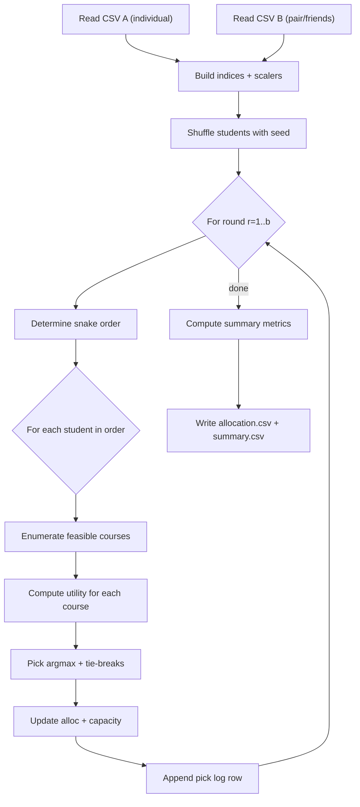

# HBS Social Snake Draft (Reactive Friends)

A small research/experimentation script that simulates a **snake draft** course allocation with a **social utility component** (friends), inspired by an HBS-style picking process.

The implementation lives in `hbs_social.py` and is designed to be:
- Deterministic (given `--seed` and the same CSV inputs)
- Auditable (writes a per-pick log with utility decomposition)
- Tunable (weights allow you to explore trade-offs between individual preference, social cohesion, and fairness proxies)

---

## Problem Statement & Motivation

**Problem.** You have a set of students and a set of courses with fixed seat capacities. Each student wants to take up to `b` courses. Students also care about **being in the same courses as their friends** (or specific peers), in addition to their personal preferences.

**Why it matters.**
- In real allocation systems (course bidding, school electives, training cohorts), ignoring social structure can reduce perceived satisfaction and participation.
- Social-aware allocation helps explore outcomes like: “Do friends end up together?”, “How does social preference impact fairness?”, and “What are the trade-offs with pure preference satisfaction?”

This repository provides a simple, transparent baseline for experimentation.

---

## High-Level Idea

Instead of solving a single global optimization problem (which can be complex or expensive), we simulate a **sequential picking process**:

1. Students are placed in a random order (seeded).
2. They take turns picking one course per round.
3. In each turn, a student selects the course with the highest **utility**:
   - **Base utility** from their own preference table
   - A **friend bonus** that rewards picking courses already chosen by friends (reactive)
   - An optional **mutuality bonus** that softly biases toward courses friends “like” (via friends’ base utilities)

This captures a realistic “human process” (drafts are used in practice), while being easy to reason about and modify.

---

## Algorithm Description

### Inputs
- Table 1 (individual preferences): `(StudentID, CourseID, Score, Position)`
- Table 2 (pair/friend preferences): `(StudentID_A, StudentID_B, CourseID, Score, Position)`
- Global parameters: capacities, number of rounds, and utility weights.

### Step-by-step
1. **Load CSVs** and collect the universe of `students` and `courses` (from both tables).
2. Initialize capacity for each course: `cap_left[c] = cap_default`.
3. Initialize allocation per student: `alloc[s] = []`.
4. **Create a deterministic random order** of students (shuffle using `seed`).
5. For each round `r = 1..b`:
   - Determine the turn order:
     - odd rounds: forward order
     - even rounds: reverse order (snake draft)
   - For each student in turn order:
     1. Enumerate feasible candidates: courses with remaining capacity and not already picked by the student.
     2. Compute the utility for each candidate course.
     3. Choose the course with the maximum utility (with deterministic tie-breaks).
     4. Update allocation and capacity.
     5. Append a `PickLogRow` including base / friend bonus / mutuality components.
6. After all rounds, compute summary metrics:
   - Individual base satisfaction mean/std
   - Social overlap utility and social overlap rates
   - Penalties for unfilled demand
   - Two “overall score” aggregations (raw and normalized)
7. Write outputs:
   - `allocation.csv`: per-pick log
   - `summary.csv`: one-row summary for the run

### Deterministic tie-breaking
When two courses have similar utility, the script breaks ties using:
1. max total utility
2. best (smallest) `Position` from Table 1
3. highest `Score` from Table 1
4. seeded random number
5. stable `CourseID` ordering

This makes results stable and reproducible while still allowing stochastic exploration via `--seed`.

---

## Mathematical Formulation

This is a **sequential decision process**, not a single global solver. Still, the per-pick decision is defined by an explicit utility function.

### Sets and indices
- Students: $S$
- Courses: $C$
- Rounds: $r \in \{1,\dots,b\}$
- Directed friend relation (from Table 2): $F(s) \subseteq S$ are friends of student $s$ (out-neighbors).

### Parameters
- Course capacity (uniform in the implementation): $\mathrm{cap}(c) = \mathrm{cap\_default}$
- Weights for Table 1 base utility: $w_S, w_P$ with $w_S + w_P = 1$
- Weights for Table 2 friend preference utility: $u_S, u_P$ with $u_S + u_P = 1$
- Social mixing weights:
  - $\lambda$ (`--lambda`) multiplies friend bonus
  - $\mu$ (`--mu`) multiplies mutuality bonus

### Normalization utilities
Let $\mathrm{normA}(\cdot)$ be min-max normalization over all Table 1 scores, and $\mathrm{normB}(\cdot)$ over all Table 2 scores.

Let $\mathrm{posU}(p) \in [0,1]$ map a 1-based rank position to a utility:

$$
\mathrm{posU}(p) = \frac{|C|-p}{|C|-1} \quad (\text{for } |C|>1)
$$

(with safe handling for degenerate cases in code).

### Base utility (Table 1)
For student $s$ and course $c$:

$$
\mathrm{Base}(s,c) = w_S \cdot \mathrm{normA}(\mathrm{ScoreA}(s,c)) + w_P \cdot \mathrm{posU}(\mathrm{PositionA}(s,c))
$$

Missing records are treated as zero in the implementation.

### Friend preference utility (Table 2)
Directed preference of $s$ to be with friend $f$ in course $c$:

$$
\mathrm{Pref}(s,f,c) = u_S \cdot \mathrm{normB}(\mathrm{ScoreB}(s,f,c)) + u_P \cdot \mathrm{posU}(\mathrm{PositionB}(s,f,c))
$$

Missing records are treated as zero.

### Reactive friend bonus
Let $A_f \subseteq C$ be the set of courses already allocated to friend $f$ at the current time. Then:

$$
\mathrm{FriendBonus}(s,c) = \sum_{f \in F(s)} \mathbf{1}[c \in A_f] \cdot \mathrm{Pref}(s,f,c)
$$

This is “reactive” because it only rewards overlap with **already-picked** courses.

### Mutuality bonus
This is a soft “friends like it” signal:

$$
\mathrm{Mutuality}(s,c) =
\begin{cases}
\frac{1}{|F(s)|}\sum_{f \in F(s)} \mathrm{Base}(f,c) & |F(s)|>0 \\
0 & \text{otherwise}
\end{cases}
$$


### Per-pick utility (decision rule)
At each pick, student $s$ selects:

$$
c^\* = \arg\max_{c \in \mathcal{C}_s} \left(
\mathrm{Base}(s,c) + \lambda \cdot \mathrm{FriendBonus}(s,c) + \mu \cdot \mathrm{Mutuality}(s,c)
\right)
$$

Where feasible set:

$$
\mathcal{C}_s = \{ c \in C \mid \mathrm{cap\_left}(c) > 0 \ \wedge\ c \notin A_s \}
$$


### Constraints
This process enforces constraints by construction:
- Capacity: total assigned to each course never exceeds capacity.
- No duplicates: a student never picks the same course twice.
- Demand is “up to $b$”: if candidates are exhausted, the student skips remaining picks.

---

## Utility Function Logic (Deep Dive)

### Why this utility makes sense
- **Base(s,c)** represents an individual student’s private preference over courses.
- **FriendBonus(s,c)** captures *realized* social matching: it rewards choosing a course that friends already chose (cohesion).
- **Mutuality(s,c)** is a “soft anticipation” term: students may be attracted to courses friends are likely to value, even before allocations happen.

This blend provides a controlled way to explore **preference vs. social cohesion vs. fairness** in a realistic sequential process.

### Tunable parameters

#### Base construction weights
- `--wS` / `--wP` (must sum to 1):
  - Increase `wS` to emphasize score values from Table 1.
  - Increase `wP` to emphasize rank/position (e.g., top-k preference structure).

#### Friend preference weights
- `--uS` / `--uP` (must sum to 1):
  - Similar to base weights, but applied to Table 2 records.

#### Social coefficients
- `--lambda` ($\lambda$):
  - Scales the reactive friend bonus.
  - Higher values increase friend clustering (more overlap), sometimes at the expense of base satisfaction.
  - Very high values can cause “follow-my-friends” behavior and reduce diversity.

- `--mu` ($\mu$):
  - Scales mutuality bonus (friends’ base preferences).
  - Higher values bias toward “friends like it” even before overlap exists; it can increase coordination earlier in the draft.
  - If set too high, it may overweight the friend graph relative to individual preferences.

#### Overall scoring weights (for analysis only)
These do **not** affect the draft decisions; they only aggregate metrics into “OverallScore”.
- Raw: `--Aw`, `--Bw`, `--gamma`, `--delta`
  - $\mathrm{OverallRaw} = A_w \cdot \mathrm{IndivAvg} + B_w \cdot \mathrm{SocialAvg} - \gamma \cdot \mathrm{PenaltyAvg} - \delta \cdot \mathrm{StdSat}$
- Normalized: `--AwN`, `--BwN`, `--gammaN`, `--deltaN`
  - Same idea but using normalized metrics (per-round) for comparability across different `b`.

---

## Practical Usage

### Requirements
- Python 3.10+ (uses modern typing)

# Running the Algorithm

This section explains how to run the course allocation algorithm and describes
each input argument in a user-friendly way.

### Run

```bash
python3 hbs_social.py \
  --csv-a tables/table1_individual.csv \
  --csv-b tables/table2_pair.csv \
  --cap-default 80 \
  --b 3 \
  --seed 42 \
  --lambda 0.5 \
  --mu 0.0 \
  --out-allocation allocation.csv \
  --out-summary summary.csv
```

## Input arguments

- **`--csv-a`**  
  Path to **Table 1 (individual preferences)**.  
  Contains each student’s personal ranking and/or score for courses.

- **`--csv-b`**  
  Path to **Table 2 (pair / friend preferences)**.  
  Describes which students want to be together and how strong that preference is.

- **`--cap-default`**  
  Default **capacity per course**.  
  Each course can accept at most this many students.

- **`--b`**  
  Number of **courses each student is allowed to pick**.  
  The algorithm runs `b` snake-style rounds, where in each round every student can pick **at most one course**.  
  Effectively, this parameter controls how many courses each student will be assigned in total.

- **`--seed`**  
  Random seed for **reproducibility**.  
  Using the same seed guarantees identical results.

- **`--lambda`**  
  Weight of the **friend preference bonus**.  
  Controls how much being with friends influences course selection.

- **`--mu`**  
  Weight of the **mutuality bonus**.  
  Adds extra reward when two students mutually prefer each other.

- **`--out-allocation`**  
  Output CSV file with the **final student → course assignment**.

- **`--out-summary`**  
  Output CSV file with **aggregate statistics**  
  (e.g., average utility, satisfaction metrics, social matching indicators).


### Input CSV formats

**Table 1 (`--csv-a`)**
```csv
StudentID,CourseID,Score,Position
S1,C1,3,4
...
```

**Table 2 (`--csv-b`)**
```csv
StudentID_A,StudentID_B,CourseID,Score,Position
S1,S2,C1,2,4
...
```

Interpretation:
- Table 2 is directed: A’s preference about being with B in a specific course.

### Output files

**Allocation log (`allocation.csv`)**
- One row per pick, including:
  - StudentID, CourseID, RoundPicked
  - UtilityAtPick and decomposed terms (Base / FriendBonus / Mutuality)

**Run summary (`summary.csv`)**
- One row with:
  - Parameters used
  - Aggregated metrics (raw and normalized)

---

## Code Structure Overview

Main file: `hbs_social.py`

Key components:
- Domain models:
  - `IndividualPref`, `PairPref`: typed records for input tables
  - `PickLogRow`: per-pick audit record
  - `RunSummary`: aggregated metrics
  - `RunResult`: full result container
- Infrastructure:
  - `_read_table_1()`, `_read_table_2()`: CSV readers with schema validation
  - `_write_allocation_csv()`, `_write_summary_csv()`: output writers
- Utility helpers:
  - `_ScoreScaler`: min-max normalization
  - `_pos_u()`: rank-to-utility conversion
- Application service:
  - `_HbsSocialDraftEngine`: runs the draft and computes metrics
- Public API:
  - `run_hbs_social()`: validates parameters, loads inputs, runs engine
- CLI:
  - `main()` + `_parse_args()`: command-line interface

Interaction flow:
1. CLI parses args → calls `run_hbs_social()`
2. `run_hbs_social()` loads CSVs → builds engine → `engine.run()`
3. Result is written via CSV writers

---

## Visual Aids & Illustrations

### Flow diagram (Mermaid)


### Conceptual illustration (ASCII)
```
Round 1 order:  s1 -> s2 -> s3 -> s4
Round 2 order:  s4 -> s3 -> s2 -> s1
Round 3 order:  s1 -> s2 -> s3 -> s4

At each pick:
  utility = base + lambda * friend_overlap_bonus + mu * friends_like_it_bonus
```

---

## Possible Improvements & Extensions

### Algorithmic improvements
- **Global optimization baseline:** compare against ILP / min-cost flow / matching for small instances.
- **Capacity heterogeneity:** allow per-course capacities (currently a single `cap_default`).
- **Prerequisites / incompatibilities:** model constraints like “cannot take C1 and C2 together”.
- **Priority / fairness policies:** add rules like quotas, priorities, or envy-reduction heuristics.
- **Strategic behavior:** model that students may not reveal true preferences; explore robustness.

### Utility model extensions
- **Diminishing returns for friend overlap:** e.g., first overlapping friend counts more than the tenth.
- **Group constraints:** allocate cohorts or teams rather than individual pairs.
- **Symmetric friend utility:** enforce mutual friend edges or combine both directions.
- **Time-aware mutuality:** estimate friend future picks (predictive models) rather than reactive overlap only.

### Architectural refactoring
- Split `hbs_social.py` into modules:
  - `domain/` for dataclasses
  - `io/` for CSV readers/writers
  - `engine/` for allocation logic
  - `cli/` for command parsing
- Add unit tests with fixtures for determinism, tie-breaking, and metric correctness.
- Add structured logging and optional JSON outputs for downstream tooling.

---

## Future Work

This baseline can be extended toward more realistic and complex allocation systems:
- **Multi-term scheduling:** courses have time slots; students cannot overlap.
- **Budgets / bidding:** students spend points; the allocator balances bids + social terms.
- **Multiple sections per course:** choose section-level capacity and schedule constraints.
- **Learning weights:** fit $\lambda, \mu$ (and other parameters) from observed behavior.
- **Policy evaluation:** run Monte Carlo experiments across seeds and report distributions, not just point metrics.

---

## License / Status

This repository is currently a lightweight research prototype intended for experimentation and teaching.
