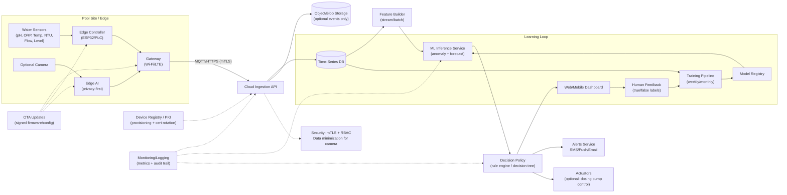

# AIoT Home Assignment — Project Execution (Lesson 10)

> This submission is written **to match the required structure**: (1) Problem & Solution, (2) Sensor Selection, (3) AI/ML Algorithms (analysis + prediction + decision-making), (4) Expected Outcomes & Benefits, plus **a separate System Architecture diagram** and a **5–6 slide deck outline**.

---

## Deliverable A — Written Project Proposal (Word/PDF content, provided here in Markdown)

### Title
**SmartPool Guardian**: AIoT system for pool **water-quality stability** and **swimmer-safety support**.

### Short abstract (3–5 lines)
Public and hotel pools rely on manual testing and periodic checks, so water-quality issues (chlorine/pH drift, turbidity spikes) and some safety events can be detected late. SmartPool Guardian combines **real-time sensor telemetry** with **AI models** to detect anomalies, predict near-future risk, and trigger actionable recommendations/alerts. The system provides a live dashboard for operators/lifeguards and a feedback loop to improve performance over time.

---

## 1) Problem & Solution Design

### Problem (1–2 paragraphs)
Pool water quality can degrade quickly due to bather load, temperature, sunlight, filtration issues, or chemical dosing problems. When pH and disinfectant levels drift outside safe ranges, operators may face swimmer irritation, higher pathogen risk, or forced shutdowns. At the same time, lifeguards and staff are overloaded and depend on periodic manual checks, which increases the chance of late detection.

### Proposed AIoT solution (1–2 paragraphs)
SmartPool Guardian is an AIoT platform that continuously collects water-quality and operational signals (e.g., pH/ORP/turbidity/temperature/flow) and optionally uses a safety camera feed. AI models (a) **analyze** real-time patterns, (b) **predict** near-term drift and risk, and (c) support **decision-making** via a policy layer (rule engine/decision tree) that generates clear actions: alerts, recommended dosing adjustments, “check filtration” prompts, and (when applicable) actuator commands to chemical dosing pumps.

This satisfies the requirement to identify a real-world problem and propose an AIoT solution.

---

## 2) IoT Sensor Selection (what + why + what data)

Minimum expectation is to clearly specify the chosen sensors and the data they collect.

### Sensor list (core)
| # | Sensor / Source | Measures | Units | Sampling rate | Where installed | Why needed (feature support) | Data-quality risks & mitigation |
|---|---|---|---|---|---|---|---|
| S1 | **pH probe** | Acidity/basicity | pH | 1/min | Main circulation line | Detect pH drift; predict dosing needs | Probe drift/fouling → auto-calibration reminders; smoothing + outlier rules |
| S2 | **ORP sensor** | Disinfection potential (proxy for chlorine effectiveness) | mV | 1/min | Main circulation line | Early warning for disinfectant drop | Noise from bubbles/flow → median filter; validation vs flow |
| S3 | **Water temperature** | Temperature | °C | 1/min | Main circulation line | Predict chemical demand and ORP response | Sensor offset → periodic check; sanity bounds |
| S4 | **Turbidity sensor** | Cloudiness / particles | NTU | 1/min | After filter (or main line) | Detect filtration problems / contamination spikes | Spike noise → hysteresis thresholds; compare to flow |
| S5 | **Flow meter** | Circulation flow | L/min | 1/min | Pump outlet | Identify pump/filter issues; interpret sensor readings | Dropouts → forward-fill short gaps; alert on sensor failure |
| S6 | **Water level sensor** (ultrasonic/pressure) | Pool level | cm / % | 1/5min | Balance tank / pool | Detect leaks/overflow; operational health | Surface noise → averaging; event-based checks |

### Optional (safety / context)
| # | Sensor / Source | Measures | Units | Sampling rate | Where installed | Why needed | Risks & mitigation |
|---|---|---|---|---|---|---|---|
| O1 | **Overhead camera** | Swimmer count + potential distress patterns | frames | 10–15 FPS (edge) | Ceiling/wall (privacy-aware angle) | Safety support: detect unusual stillness/struggle; correlate bather load to chemistry | Privacy → no face storage; on-edge inference; store only events/metadata |
| O2 | **Weather/UV API** | Solar load proxy | index | 15–60min | Cloud | Improves drift prediction (sunlight affects chlorine) | Missing data → fallback to recent baseline |

---

## 3) AI / ML Algorithms (analysis, prediction, decision-making)

The assignment requires describing the algorithms and ensuring they cover **analysis, prediction, and decision-making**.

### 3.1 Data pipeline
1) **Ingestion**: time-series telemetry from sensors (MQTT/HTTP) + optional camera metadata.
2) **Preprocessing**: resampling to 1-minute grid; missing value handling; de-noising filters; sensor sanity checks.
3) **Feature engineering** (sliding windows):
   - Rolling mean/std/min/max for pH/ORP/NTU/Temp/Flow (e.g., 5, 15, 60 min windows)
   - Trends (Δ over 15 min), rate-of-change, cross-sensor consistency (e.g., ORP vs pH & Temp)
   - Event flags: sudden turbidity spike, flow drop, level drop

### 3.2 Models (what + why)
**A) Water-quality anomaly detection (analysis)**
- **Model**: Multivariate **Autoencoder** (or Isolation Forest as a simpler baseline)
- **Inputs**: [pH, ORP, Temp, Turbidity, Flow, Level] features
- **Output**: anomaly score \(a_t\)
- **Why**: Finds abnormal patterns without needing heavy labeling of “bad events” (often rare)

**B) Near-term drift prediction (prediction)**
- **Task**: forecast pH and ORP in the next 30–120 minutes and estimate “risk of leaving safe range”
- **Model**: Gradient Boosted Regression Trees (XGBoost-like) or LSTM (optional)
- **Outputs**:
  - \(\hat{pH}_{t+60}\), \(\hat{ORP}_{t+60}\), plus confidence intervals
  - risk score \(r_t = P(\text{out-of-range in } [t, t+60])\)
- **Why**: forecasting supports proactive interventions (dose earlier, avoid closures)

**C) Optional safety event detection (analysis + prediction)**
- **Model**: Lightweight CNN / pose-based heuristic on edge (conceptual)
- **Output**: distress likelihood \(d_t\), swimmer count \(n_t\)
- **Why**: helps lifeguards by highlighting “high attention” moments; swimmer count improves chemistry forecasting (bather-load proxy)

### 3.3 Decision-making policy (must be explicit)
Decision-making is implemented as a **rule engine / decision tree** that consumes model outputs and produces actions.

**Inputs to the policy layer**: anomaly score \(a_t\), drift risk \(r_t\), predicted values \(\hat{pH}, \hat{ORP}\), turbidity event flag, flow anomalies, and (optional) distress score \(d_t\).

**Configured thresholds (examples; tune per facility and local standards)**
- \(pH_{min}=7.2\), \(pH_{max}=7.8\) (example operating band; site-specific)
- \(ORP_{min}=650\text{ mV}\) (example; depends on chemistry and regulation)
- \(NTU_{max}=0.5\text{–}1.0\) (example clarity band; depends on standards and sensor)
- \(a_{crit}\): calibrated to achieve the target false-alarm rate (see §3.4)

**Actuation safety (if dosing pumps are integrated)**
- Default mode is **human-in-the-loop**: system recommends actions; operator confirms execution.
- Automatic actuation requires an explicit “auto-control enabled” switch + role-based permission.
- Safety interlocks: block actuation on sensor-fault flags, missing data, low confidence, or detected sensor drift.
- Rate limits and caps: max dose change per interval, max cumulative change per hour, and cooldown windows.
- Audit trail: every recommendation/actuation stores who/what/when and the telemetry that triggered it.

**Example policy (human-readable, implementable):**
1) **Emergency water-quality alert**
   - IF \(a_t > a_{crit}\) OR (turbidity spike AND flow drop)
     → *Send urgent alert* (“Possible filtration failure or contamination”), recommend immediate manual test + inspect filter/pump.

2) **Preventive dosing recommendation**
   - IF \(r_t > 0.7\) OR \(\hat{ORP}_{t+60} < ORP_{min}\)
     → Recommend chlorine adjustment (display dosage range + ask for confirmation), schedule re-check in 10–15 min.

3) **pH stabilization**
   - IF \(\hat{pH}_{t+60}\) predicted outside \([pH_{min}, pH_{max}]\)
     → Recommend acid/base correction; highlight likely cause (high bather load, temperature, or dosing lag).

4) **Safety support (optional camera)**
   - IF \(d_t > 0.8\) for > 5 seconds
     → Notify lifeguard device (“Check lane/zone X now”).

### 3.4 Training, validation, and ground truth (how we know it works)
To keep the system credible and measurable, model performance is evaluated against **ground truth** and baselines.

**Ground truth sources**
- Manual test kits / lab checks (scheduled + after alerts) used as reference for pH/ORP/clarity.
- Maintenance and incident logs (filter backwash, pump faults, closures) used as event labels.
- Operator feedback labels (*true/false/uncertain*) attached to each alert.

**Validation approach (time-series safe)**
- Use chronological splits (train → validation → test) to avoid leakage.
- Compare to simple baselines: moving average + threshold rules; ARIMA/ETS for forecasting; Isolation Forest as an anomaly baseline.
- Tune \(a_{crit}\) on validation data to meet the operational false-alarm target, then report final metrics on the held-out test period.

---

## 4) Expected Outcomes & Benefits (quantified)

The assignment requires quantifying benefits and impact, including precision/accuracy targets, units, and measurement methods.

### 4.1 Model metrics (targets)
**Water-quality anomaly detection**
- False alarm rate: **≤ 5% / day** (measured as fraction of alerts judged “false” by operator review)
- Detection latency: **< 2 minutes** from abnormal change onset (estimated via event logs)

**Drift forecasting**
- ORP prediction MAE (60-min horizon): **≤ 20 mV**
- pH prediction MAE (60-min horizon): **≤ 0.10 pH**

**Optional safety detection (if camera used)**
- Recall for distress-like events: **≥ 90%** (to minimize missed events)
- Precision: **≥ 80%** (to reduce alert fatigue)
- Detection latency: **≤ 10 seconds**

### 4.2 Operational metrics
- Time to detect “water-quality issue” (from onset): **< 5 minutes** (baseline: periodic manual checks)
- Reduction in unplanned closures due to late detection: **≥ 30%** per season
- Reduction in chemical overdosing events: **≥ 15%** (compare chemical consumption per bather-hour)

### 4.3 Business / impact metrics
- Monthly cost savings from optimized chemical usage + fewer shutdowns: **estimate 5–15%** OPEX reduction (validated during pilot)
- Reduced incident risk: fewer out-of-range periods (minutes/week outside safe ORP/pH band)

### 4.4 How we measure (baseline → target)
- Baseline: current logs (manual test frequency, chemical usage records, closure events, maintenance tickets)
- Target measurement: dashboard audit trail (alerts, confirmations, actions taken) + lab/manual checks as ground truth

---

## 5) Feedback loop (must be explicit)

Class Q&A explicitly requires explaining how outcomes feed back into algorithms to improve them.

**Feedback signals collected**
- Operator/lifeguard label after each alert: *true / false / uncertain*
- Actions taken: dosing change, filter backwash, pump inspection, lane closure
- Post-action outcomes: did ORP/pH stabilize? did turbidity drop? (within 30–120 min)

**Learning loop**
1) Store feedback and outcomes with timestamps (training dataset grows over time)
2) Weekly / monthly retraining:
   - Update drift-forecast model with new seasons and bather-load patterns
   - Calibrate anomaly threshold \(a_{crit}\) to maintain target false-alarm rate
3) Drift detection:
   - Detect sensor drift (slow bias) and concept drift (seasonal changes)
   - Trigger “re-calibration needed” tasks and/or model refresh

---

# Deliverable B — System Design Document (System Architecture Diagram)

A clear visual diagram with key components and data flow is required.

## Architecture (UML-like, data-flow)

### Notes (what each block does)
- **Edge controller** reads sensors, performs initial validation, and streams telemetry.
- **Inference service** produces anomaly scores and drift forecasts.
- **Policy layer** converts model outputs into actions and prevents alert noise.
- **Feedback loop** uses human validation + outcomes for periodic retraining.

---

# Deliverable C — Short Presentation (5–6 slides, 3–4 bullets each)

Slides should be ~5–6 with ~3–4 bullets/slide in a semi-visual lecture style.

## Slide 1 — Problem
- Pool chemistry can drift fast (bather load, temperature, sunlight, filtration)
- Manual checks are periodic → late detection + closures + risk
- Lifeguards/operators face alert fatigue and limited attention

## Slide 2 — Proposed AIoT Solution (SmartPool Guardian)
- Real-time sensors stream water-quality + operational telemetry
- AI detects anomalies + predicts near-term drift (30–120 min)
- Policy layer turns predictions into clear actions (alerts/recommendations)

## Slide 3 — Sensors & Data
- Core: pH, ORP, Temp, Turbidity, Flow, Water level
- Optional: overhead camera (privacy-first) + weather/UV context
- Sampling: 1/min time-series → features in 5/15/60-min windows

## Slide 4 — AI/ML Pipeline + Decision-Making
- Autoencoder/Isolation Forest → anomaly score
- Forecast model → \(\hat{pH}, \hat{ORP}\) and risk of out-of-range
- Decision tree / rule engine → alerts + dosing/maintenance recommendations (human-in-the-loop)

## Slide 5 — System Architecture
- Sensors → edge controller → secure gateway → cloud ingestion
- Time-series DB + ML inference service + dashboard
- Alerts to lifeguard/operator; optional actuator integration

## Slide 6 — Outcomes & Feedback Loop
- Targets: low false alarms (≤5%/day), fast detection (<2 min)
- Reduce closures (≥30%) + reduce overdosing (≥15%)
- Feedback + manual-test ground truth → weekly/monthly retraining + drift checks

---

## Submission note
In the course submission, you can copy this content into:
- **Proposal** (Word/PDF): sections “Deliverable A” (without the diagram if you want to keep it separate)
- **System design**: the Mermaid diagram (or redraw it in draw.io) + legend
- **Slides**: use the slide bullets as deck content

